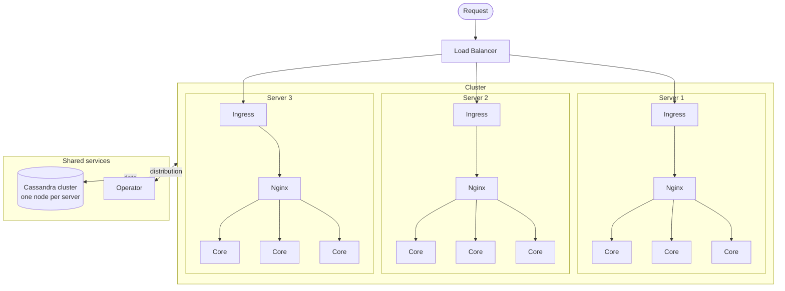

<div align="center">
  <picture>
    <source media="(prefers-color-scheme: dark)" srcset=".github/logo-light.webp">
    
  </picture>

  <h1><b>Dulno - Core</b><br><br></h1>

</div>

Core of the backend of Dulno. Each module relies on the core. It bundles central functionalities and forms the framework of the entire application.

## Status

|      | Pipeline status                                                      |
|------|----------------------------------------------------------------------|
| main |  |

## Architecture

Each server in the cluster runs an ingress and an Nginx instance that balance requests across several core replicas. All core instances share a Cassandra database cluster and register with the [operator](https://github.com/dulno/dulno-operator), which distributes work between the nodes.



At startup, the core loads all module JARs (for example [access](https://github.com/dulno/dulno-access)) from the `/modules` directory.

## Integration
This module can be integrated into a submodule.

To do this, publish the core to your local Maven repository first:
```bash
./gradlew publishToMavenLocal
```

Then add `mavenLocal()` to the repositories in *build.gradle.kts*:
```kotlin
repositories {
  mavenCentral()
  mavenLocal()
}
```

The repository can then be added and used like a regular dependency. This is done in the following way:
```kotlin
dependencies {
  compileOnly("com.dulno:core:1.0.0-SNAPSHOT")
}
```

## License

© Dulno. Licensed under [CC BY-NC-SA 4.0](LICENSE): free for non-commercial use with attribution to Dulno, modifications must be shared under the same license. Third-party code (e.g. under `static/dependency/`) keeps its own license.
